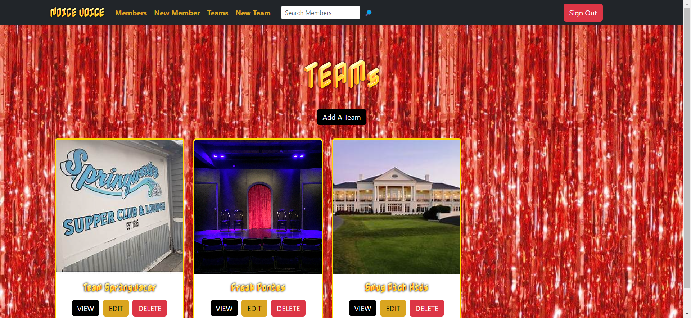
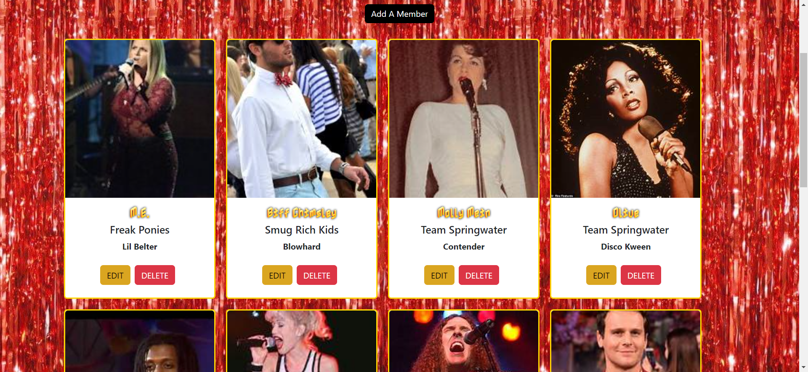
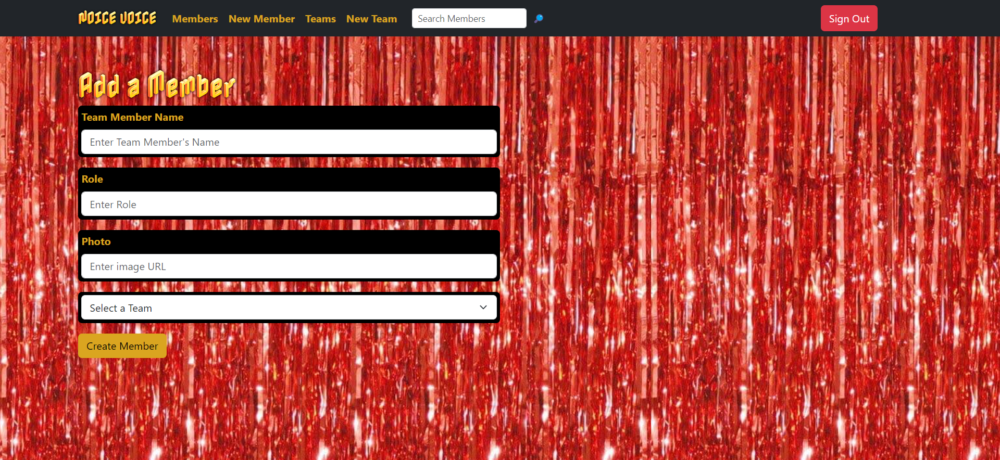
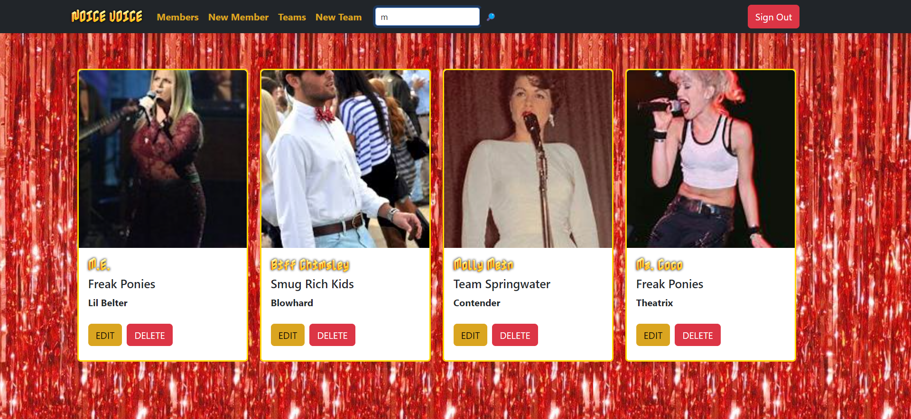

# NOICE VOICE (Team Roster)

Team sports need not only be for people who are good at sports. Choose your fighters and make karaoke teams to battle in the ultimate showdown! 

[View App](https://delightful-jelly-1874d1.netlify.app/)

## About the User
- The ideal user for this application is a karaoke competition organizer.
- They need to publish team members and details so people can see who is competing.
- The app allows users to visually organize their teams.

## Features
- The app uses Firebase to store created teams and team members.
- Users can view all competing members, all teams, and members filtered by team.
- When a user creates or edits a team or a team member, that object is saved to Firebase and prints to the DOM.
- When a user deletes a team or team member, that object is deleted from Firebase and removed from the DOM. When a team is deleted, its members are also deleted.
- Users can search members by name!

## Video Walkthrough of NOICE VOICE
https://www.loom.com/share/0315512906ee4594b72d84dc5767a881

## Relevant Links
- [Check out the deployed site](https://delightful-jelly-1874d1.netlify.app/)
- [User Flow](https://www.figma.com/file/Dasju0NLEhSVUYSxLw6lyv/rosterMVP?type=whiteboard&node-id=0-1&t=mvm2WLOoTYtLL7mG-0)
- [Project Board](https://github.com/users/cnfairall/projects/3)

## Project Screenshots

## Contributors
- [COURTNEY FAIRALL](https://github.com/your-github-url](https://github.com/cnfairall)https://github.com/cnfairall)
